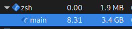
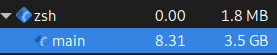
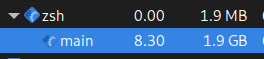

# 1-oji objektinio programavimo užduotis

## Programos kompiliavimas ir paleidimas

Projektą galima paleisti komandinėje eilutėje arba savo pasirinktame IDE (pvz. CLion, Visual Studio
arba VScode) su cmake.

## Programos veikimo pavyzdys

```
------------------------------------------------------------------
Įvesti studentų duomenis iš failo - 1
Įvesti studentų duomenis komandinėje eilutėje - 2
Sugeneruoti duomenų failą - 3
Testuoti programos veikimo greitį - 4
Sugeneruoti naujus failus testavimui - 5
Ištestuoti skirtingas studentų dalijimo realizacijas - 6
------------------------------------------------------------------

Jūsų pasirinkimas: 2
Įveskite studento vardą: Bill
Įveskite studento pavardę: Gates
Ar žinote kiek pažymių turi studentas ("-1" jeigu nežinote)? 5
Sugeneruoti pažymius automatiškai (T arba N)? T
Įveskite studento egzamino pažymį: 10
Ar norite įvesti dar vieno studento pažymius (T arba N)? N


Pavarde        Vardas         Galutinis (Vid.)    Galutinis (Med.)    
------------------------------------------------------------------
Gates          Bill           8.40                8.40             
```
## Versijos v1.1 aprašymas
### Struktūros ir klasės palyginimas

| Vector                      | 100000       | 1000000     | 10000000  |
|-----------------------------|--------------|-------------|-----------|
| Klasė                       | 0.163838 s   | 1.69753 s   | 18.0604 s |
| Struktūra                   | 0.164924 s   | 1.71637 s   | 18.4865 s |

Programos veikimo greitis beveik nepriklauso nuo to, ar yra panaudota struktūra, ar klasė.

### Optimizavimo flagų palyginimas

| Vector                      | 100000       | 1000000     | 10000000  |
|-----------------------------|--------------|-------------|-----------|
| Be optimizacijos            | 0.551414 s   | 6.03869 s   | 65.9000 s |
| O1                          | 0.172355 s   | 1.77483 s   | 18.8961 s |
| O2                          | 0.169416 s   | 1.74215 s   | 18.4922 s |
| O3                          | 0.167442 s   | 1.71698 s   | 18.2578 s |

Šiuo atveju tarp skirtingų flagų nėra didelio skirtumo. Tačiau, yra svarbu kompiliuoti su optimizacija, nes be jos programos veikimo yra labai lėtas.

## Versijos v1.0 aprašymas

## Skirtingų realizacijų veikimo greitis:

### Realizacija 1:

Bendro studentai konteinerio (vector, list ir deque tipų) skaidymas (rūšiavimas) į du naujus to paties tipo
konteinerius: "vargšiukų" ir "kietiakų". Veikia greitai, bet sunaudoja labai daug RAM.

| Vector                      | 100000       | 1000000     | 10000000  |
|-----------------------------|--------------|-------------|-----------|
| Failo nuskaitymo laikas:    | 0.148729 s   | 1.3266 s    | 14.0391 s |
| Vektorių padalijimo laikas: | 0.00618527 s | 0.0615252 s | 1.25117 s |
| Pilnas laikas:              | 0.154914 s   | 1.38813 s   | 15.2903 s |

| List                        | 100000       | 1000000     | 10000000  |
|-----------------------------|--------------|-------------|-----------|
| Failo nuskaitymo laikas:    | 0.13276 s    | 1.33412 s   | 13.8171 s |
| Vektorių padalijimo laikas: | 0.00608981 s | 0.0635772 s | 1.07551 s |
| Pilnas laikas:              | 0.13885 s    | 1.3977 s    | 14.8926 s |

| Deque                       | 100000       | 1000000     | 10000000   |
|-----------------------------|--------------|-------------|------------|
| Failo nuskaitymo laikas:    | 0.140826 s   | 1.40578 s   | 14.1657 s  |
| Vektorių padalijimo laikas: | 0.00612058 s | 0.0636378 s | 0.622911 s |
| Pilnas laikas:              | 0.146947 s   | 1.46942 s   | 14.7886 s  |

### Realizacija 2:

Bendro studentų konteinerio (vector, list ir deque) skaidymas (rūšiavimas) panaudojant tik vieną naują konteinerį: "
vargšiukai". Sunaudoja mažiausiai RAM, bet labai lėtai veikia su vector ir deque.

| Vector                      | 100000     | 1000000 | 10000000 |
|-----------------------------|------------|---------|----------|
| Failo nuskaitymo laikas:    | 0.133184 s | -       | -        |
| Vektorių padalijimo laikas: | 28.9236 s  | -       | -        |
| Pilnas laikas:              | 29.0568 s  | -       | -        |

| List                        | 100000       | 1000000     | 10000000   |
|-----------------------------|--------------|-------------|------------|
| Failo nuskaitymo laikas:    | 0.131192 s   | 1.32684 s   | 13.9231 s  |
| Vektorių padalijimo laikas: | 0.00303444 s | 0.0303831 s | 0.298323 s |
| Pilnas laikas:              | 0.134227 s   | 1.35722 s   | 14.2214 s  |

| Deque                       | 100000     | 1000000 | 10000000 |
|-----------------------------|------------|---------|----------|
| Failo nuskaitymo laikas:    | 0.133852 s | -       | -        |
| Vektorių padalijimo laikas: | 9.76646 s  | -       | -        |
| Pilnas laikas:              | 9.90031 s  | -       | -        |

### Realizacija 0:

Mano originali realizacija. Sunaudoja nedaug operatyviosios atminties ir veikia pakankamai greitai su visais
konteineriais.

| Vector                      | 100000      | 1000000    | 10000000  |
|-----------------------------|-------------|------------|-----------|
| Failo nuskaitymo laikas:    | 0.140742 s  | 1.4254 s   | 14.2964 s |
| Vektorių padalijimo laikas: | 0.0244523 s | 0.350025 s | 4.1839 s  |
| Pilnas laikas:              | 0.165194 s  | 1.77543 s  | 18.4803 s |

| List                        | 100000      | 1000000    | 10000000  |
|-----------------------------|-------------|------------|-----------|
| Failo nuskaitymo laikas:    | 0.135994 s  | 1.43639 s  | 14.4541 s |
| Vektorių padalijimo laikas: | 0.0461581 s | 0.798546 s | 12.3898 s |
| Pilnas laikas:              | 0.182152 s  | 2.23493 s  | 26.8439 s |

| Deque                       | 100000      | 1000000    | 10000000  |
|-----------------------------|-------------|------------|-----------|
| Failo nuskaitymo laikas:    | 0.13845 s   | 1.48607 s  | 15.0902 s |
| Vektorių padalijimo laikas: | 0.0309267 s | 0.413819 s | 5.31916 s |
| Pilnas laikas:              | 0.169377 s  | 1.89989 s  | 20.4094 s |

## Skirtingų realizacijų RAM panaudojimas:

### Pagal sunaudota RAM (nuo mažiausio panaudojimo iki didžiausio):

1. Realizacija 2
2. Realizacija 0
3. Realizacija 1

### Realizacija 1, vector:



### Realizacija 1, list:


### Realizacija 1, deque:



 ---

### Realizacija 2, list:



---

### Realizacija 0, vector:


### Realizacija 0, list:


### Realizacija 0, deque:


## Versijos v0.5 aprašymas

### Testavimo sistema:

- CPU: AMD Ryzen 5 1600 3.6Ghz
- RAM: 16GB 3200MHz
- SSD: 1TB SATA

### Testavimo rezultatai:

| Vector                      | 1000          | 10000         | 100000      | 1000000    | 10000000  |
|-----------------------------|---------------|---------------|-------------|------------|-----------|
| Failo nuskaitymo laikas:    | 0.00156437 s  | 0.01364 s     | 0.139249 s  | 1.38866 s  | 14.1488 s |
| Rūšiavimo laikas:           | 0.000140243 s | 0.00138938 s  | 0.0174134 s | 0.227699 s | 2.82822 s |
| Vektorių padalijimo laikas: | 0.000059392 s | 0.000679204 s | 0.0113564 s | 0.186192 s | 2.22674 s |
| Pilnas laikas:              | 0.00176401 s  | 0.0157086 s   | 0.168019 s  | 1.80255 s  | 19.2038 s |

| List                        | 1000          | 10000         | 100000      | 1000000    | 10000000  |
|-----------------------------|---------------|---------------|-------------|------------|-----------|
| Failo nuskaitymo laikas:    | 0.00133846 s  | 0.0133157 s   | 0.136074 s  | 1.44558 s  | 14.6822 s |
| Rūšiavimo laikas:           | 0.000077305 s | 0.00111127 s  | 0.0336137 s | 0.549307 s | 9.57814 s |
| Vektorių padalijimo laikas: | 0.000054452 s | 0.000631104 s | 0.0202938 s | 0.222197 s | 2.37254 s |
| Pilnas laikas:              | 0.00147022 s  | 0.0150581 s   | 0.189982 s  | 2.21708 s  | 26.6329 s |

| Deque                       | 1000          | 10000         | 100000      | 1000000    | 10000000  |
|-----------------------------|---------------|---------------|-------------|------------|-----------|
| Failo nuskaitymo laikas:    | 0.00131495 s  | 0.0132299 s   | 0.164927 s  | 1.4533 s   | 15.1485 s |
| Rūšiavimo laikas:           | 0.000162264 s | 0.00175371 s  | 0.0269816 s | 0.303426 s | 4.18401 s |
| Vektorių padalijimo laikas: | 0.000033813 s | 0.000322725 s | 0.0154212 s | 0.121304 s | 1.78823 s |
| Pilnas laikas:              | 0.00151102 s  | 0.0153063 s   | 0.20733 s   | 1.87803 s  | 21.1207 s |

### Išvados

Vector konteineris veikia greičiau nei List ir Deque, kai studentų skaičius yra daugiau nei 100000.
Tačiau, kai studentų skaičius yra mažas, List ir Deque konteineriai veikia greičiau.

## Versijos v0.4 aprašymas

Programos veikimo laikas, kai kiekvienas studentas turi po 10 pažymių:

|                            | 1000        | 10000       | 100000    | 1000000  | 10000000 |
|----------------------------|-------------|-------------|-----------|----------|----------|
| Failo nuskaitymo laikas    | 0.00145373  | 0.0136561   | 0.141471  | 1.38757  | 14.2994  |
| Rūšiavimo laikas           | 0.000123762 | 0.00133734  | 0.0176121 | 0.222841 | 2.75276  |
| Vektorių padalijimo laikas | 0.000049613 | 0.000700154 | 0.0116927 | 0.187523 | 2.18616  |
| Įrašymo į failus laikas    | 0.000815409 | 0.00681796  | 0.0699192 | 0.715964 | 7.29826  |
| Pilnas laikas              | 0.00244251  | 0.0225115   | 0.240696  | 2.51389  | 26.5366  |

## Versijos v0.3 aprašymas

Pabaigta programos v0.3 versija. Programos struktūra buvo pertvarkyta, visi source failai dabar yra saugomi src aplanke.
Try-catch blokas yra panaudotas failo atidarymui tikrinti.

Paleisti galima komandinėje eilutėje su g++ kompiliuojant tinkamus failus, arba kaip CMake projektą.

## Versijos v0.2 aprašymas

Pabaigta programos v0.2 versija. Duomenis galima nuskaityti iš failo.
Outputas yra gražiai išlygiuotas ir studentai yra surūšiuoti pagal pavardes.

Paleisti galima komandinėje eilutėje su g++ kompiliuojant tinkamą failą, arba kaip CMake projektą.

## Versijos v0.1 aprašymas

Pabaigta programos v0.1 versija. Studentų namų darbai gali būti saugomi arba į C masyvą, arba į vektorių.

Paleisti galima komandinėje eilutėje su g++ kompiliuojant tinkamą failą, arba kaip CMake projektą.
